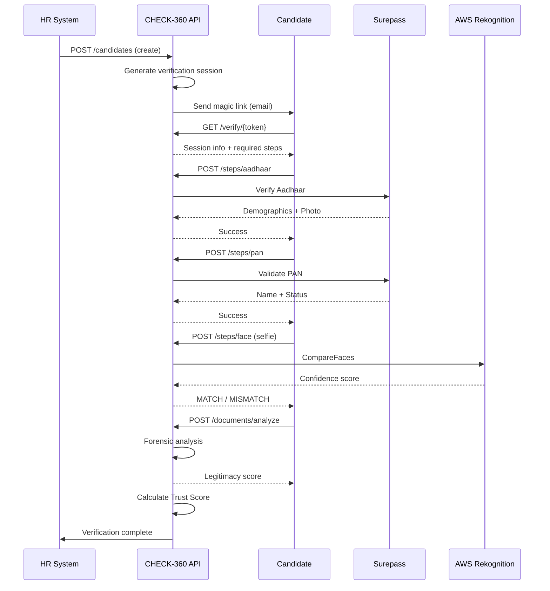

# Candidate Verification Flow

## Overview

This document describes the complete verification journey from candidate link to final score.

## Sequence Diagram

## Step Details

### Step 1: Session Creation
- HR creates candidate via API.
- System generates one-time token.
- Email sent to candidate.

### Step 2: Identity Verification
- Candidate enters Aadhaar.
- Surepass validates against UIDAI.
- Photo extracted for face match.

### Step 3: Face Verification
- Candidate captures live selfie.
- Rekognition compares to Aadhaar photo.
- Confidence score recorded.

### Step 4: Document Upload
- Candidate uploads education/experience docs.
- Forensic engine analyzes for tampering.
- Legitimacy score calculated.

### Step 5: Score Calculation
- All data aggregated.
- Trust Score computed.
- Status assigned (VERIFIED/FLAGGED).

## Timing

| Step | Expected Duration |
|------|-------------------|
| Aadhaar verify | 3-5 seconds |
| PAN verify | 2-3 seconds |
| Face compare | 2-4 seconds |
| Document analysis | 5-15 seconds |
| Score calculation | < 1 second |
| **Total** | **~30 seconds** |
