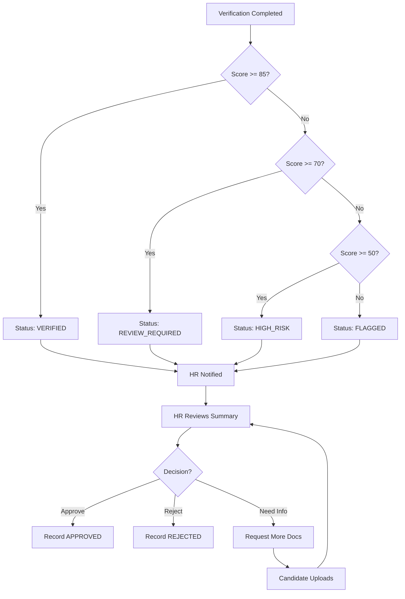

# HR Review Flow

## Overview

After candidate completes verification, HR reviews the results and makes a decision.

## Flow Diagram

## HR Actions

### 1. View Summary
`GET /hr/candidates/{id}/summary`

HR sees:
- Candidate info
- Trust Score with breakdown
- All flags by category
- Face comparison result
- Document analysis results

### 2. Upload Additional Documents
`POST /hr/documents/upload`

For missing or clarification documents.

### 3. Record Decision
`POST /hr/decision/{verification_id}`

Options:
- `APPROVED` - Candidate cleared
- `REJECTED` - Candidate failed
- `NEED_MORE_INFO` - Additional documents required

### 4. Override (If Needed)
When score is low but HR has external evidence:

1. HR requests override.
2. Senior HR approves.
3. Override logged with justification.

## Audit Requirements

Every HR action is logged:
- Who viewed what
- Who uploaded what
- Who decided what
- Who overrode what
