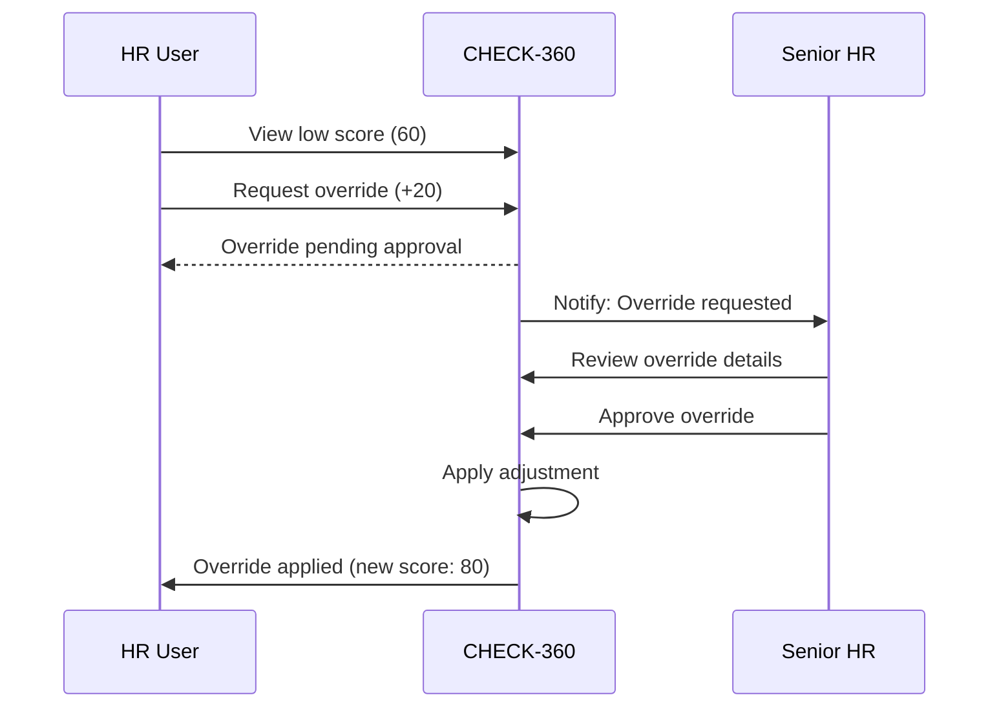

# Manual Override Flow

## Purpose

Allow HR to override Trust Score when they have external evidence that the system cannot see.

## Valid Override Reasons

| Reason Code | Description | Example |
|-------------|-------------|---------|
| `EXPLAINABLE` | Candidate explained discrepancy | Name change due to marriage |
| `EXTERNAL_VERIFIED` | HR verified externally | Called previous employer |
| `SYSTEM_ERROR` | Known system issue | Vendor returned wrong data |
| `DOCUMENTATION_PROVIDED` | Candidate provided proof | Affidavit uploaded |

## Flow



## Authorization

| Action | Required Role |
|--------|---------------|
| View score | `hr`, `senior_hr`, `admin` |
| Request override | `hr`, `senior_hr`, `admin` |
| Approve override | `senior_hr`, `admin` only |

## Audit Trail

Every override creates an immutable record:

```sql
INSERT INTO trust_score_overrides (
    trust_score_id,
    original_score,
    adjustment,
    new_score,
    reason,
    comment,
    overridden_by,
    approved_by,
    created_at
) VALUES (...)
```

## Constraints

- Maximum adjustment: ±30 points
- Comment required (min 20 characters)
- Cannot override `VERIFIED` status candidates
- Cannot reduce approved candidate's score
